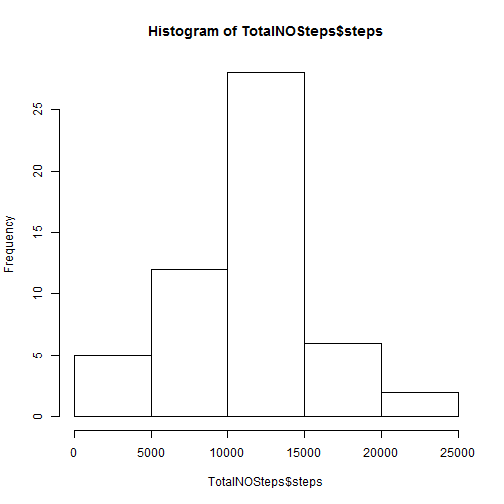
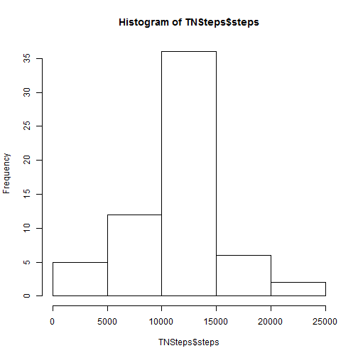
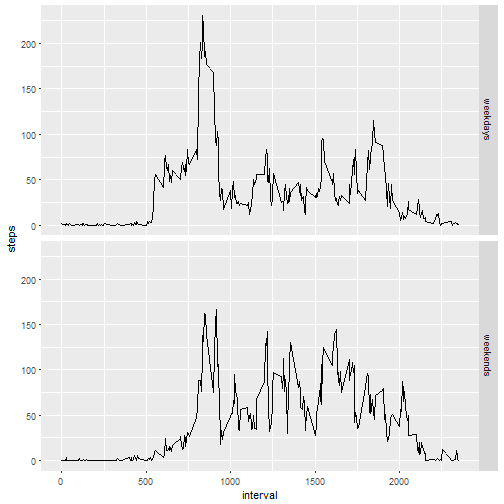

The Activity Monitoring Data
============================================
Here we are going to load the Activity data without NA.

```r
Activity<-read.csv("activity.csv")
NewActivity<-na.omit(Activity)
```
Now we are going to Calculate and Histogram of the total number of steps taken each day

```r
TotalNOSteps<-aggregate(steps~date,NewActivity,sum)
hist(TotalNOSteps$steps)  
```


============================================================
What is the mean of total number of steps taken per day?


```r
MeanTotalNOSteps<-mean(TotalNOSteps$steps)
print(MeanTotalNOSteps)   
```

```
## [1] 10766.19
```

What is the median of total number of steps taken per day?

```r
MedianTotalNOSteps<-median(TotalNOSteps$steps)
print(MedianTotalNOSteps)   
```

```
## [1] 10765
```
Time series plot of the average number of steps taken

```r
AVGNOSteps<-aggregate(steps~interval,NewActivity,mean)
library(ggplot2)
```

```
## Warning: package 'ggplot2' was built under R version 3.4.4
```

```r
y<-ggplot(AVGNOSteps,aes(interval,steps))+geom_line()
print(y)  
```


=================================================================
The 5-minute interval that, on average, contains the maximum number of steps


```r
Intervalofmaxnosteps<-AVGNOSteps[which.max(AVGNOSteps$steps),]$interval
str(Intervalofmaxnosteps)
```

```
##  int 835
```
The total number of missing values in the dataset

```r
sumofNA<-sum(is.na(Activity))
str(sumofNA)
```

```
##  int 2304
```

Devise a strategy for filling in all of the missing values in the dataset
1-We are going to fill the NA steps with the mean of steps  per intervals 

```r
avgsteps<-aggregate(steps~interval,NewActivity,mean)
head(avgsteps)
```

```
##   interval     steps
## 1        0 1.7169811
## 2        5 0.3396226
## 3       10 0.1320755
## 4       15 0.1509434
## 5       20 0.0754717
## 6       25 2.0943396
```

```r
avgstepsspecific<-avgsteps[avgsteps$interval %in% "5",]
avgstepsspecific$steps
```

```
## [1] 0.3396226
```
2-create dataset to fill NA with the above strategy(mean of steps per interval)

```r
for(i in 1:nrow(Activity))
{
  if(is.na(Activity[i,]$steps))
  {
    Activity[i,]$steps=avgsteps[avgsteps$interval %in% Activity[i,]$interval ,]$steps

  }
  
  
}
```


Make a histogram of total no of steps after fill the missing data


```r
TNSteps<-aggregate(steps~date,Activity,sum)
hist(TNSteps$steps) 
```


===================================================
What is the mean of total number of steps taken per day after fill the missing data ?


```r
MeanTNSteps<-mean(TNSteps$steps)
print(MeanTNSteps) 
```

```
## [1] 10766.19
```

What is the median of total number of steps taken per day after fill the missing data ?


```r
MedTNSteps<-median(TNSteps$steps)
print(MedTNSteps) 
```

```
## [1] 10766.19
```

The mean and the median approxmitaly the same


Are there differences in activity patterns between weekdays and weekends?
1-Create a new factor variable in the dataset with two levels - "weekday" and "weekend" indicating whether a given date is a weekday or weekend day

```r
Activity[,2]<-as.Date(Activity$date)
Activity$Day<-weekdays(Activity$date)

for(i in 1:nrow(Activity))
{
  if(Activity[i,]$Day=="Saturday"|Activity[i,]$Day=="Sunday")
  {
 Activity[i,]$Day<-"weekends"
  }
  else
  {
    Activity[i,]$Day<-"weekdays"
    
  }
  
}

head(Activity)
```

```
##       steps       date interval      Day
## 1 1.7169811 2012-10-01        0 weekdays
## 2 0.3396226 2012-10-01        5 weekdays
## 3 0.1320755 2012-10-01       10 weekdays
## 4 0.1509434 2012-10-01       15 weekdays
## 5 0.0754717 2012-10-01       20 weekdays
## 6 2.0943396 2012-10-01       25 weekdays
```

2-Plot by using the Day as a factor


```r
z<-aggregate(steps~interval+Day,Activity,mean)
library(ggplot2)
y<-ggplot(z,aes(interval,steps))+geom_line() + facet_grid(Day ~ . )
print(y)
```


